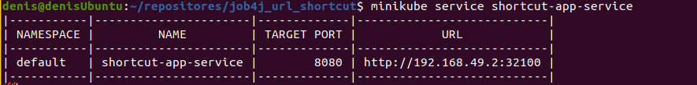

[](https://github.com/DenisYakovinov/job4j_url_shortcut/actions/workflows/maven.yml)
[](https://codecov.io/gh/DenisYakovinov/job4j_url_shortcut)
# job4j_url_shortcut

Creating a service for safely connecting users to websites <br>
The service allows the user to receive shortened links to their website. <br>
The real link is replaced with a shortened encoded string. <br>
When using a shortened link, the application will redirect to the original URL. <br>

<h2>Technologies</h2>
<ul>
    <li>Spring Boot, MVC, Data JPA, AOP, Security</li>
    <li>Postgres</li>
    <Li>liquibase</Li>
    <Li>slf4j, logback</Li>
    <Li>Swagger</Li>
    <li>Junit, Mockito</li>
</ul>
in progress..

Swagger UI documentation available via link ```localhost:8080/swagger-ui/index.html```
 <br>

1. First, register a site
login and password are generated for each registered site
 <br>

2. then, Authorize the site<br>
Authorization is carried out via JWT.<br>
The user sends a POST request with the login and password<br>
that was generated during registration and receives a JWT token<br>
This key is sent in the request in the request header.<br>
POST/registration, GET/redirect/UNIQUE CODE requests are available without authorization.<br>
 <br>
 <br>

3. URL registration.<br>
After the user has registered his site, he can send links to the site and receive converted links<br>
(shortened encoded string)
 <br>
 <br>
<br>

4. Redirection. Performed without authorization.<br>
When the site sends a link with a code, the associated address and status 302 will be returned in response.<br>
Request<br>
GET /redirect/unique_code<br>
The response from the server is in the header.<br>
HTTP CODE - 302 redirect_url<br>
as you can see<br>
 <br>
this address will be resolved to:
 <br>

5. Statistics
The service counts the number of calls for each address.<br>
The user can get the number of visits to each link on the registered site
 <br>

 <br>

# Running via Docker Compose

1. clone the project
```
https://github.com/DenisYakovinov/job4j_url_shortcut.git
```
2. go to the project root:
```
cd job4j_url_shortcut
```
3. then build the application:
```
docker-compose build
```
4. and run db and app
```
docker-compose up
```

# Running in a K8s cluster
* docker, kubectl, minikube must be pre-installed on your computer
* from the project root:

1. create secret:
```
kubectl apply -f k8s/postgresdb-secret.yml
```
2. create configMap:
```
kubectl apply -f k8s/postgresdb-configmap.yml
```
3. create database deployment:
```
kubectl apply -f k8s/postgresdb-deployment.yml
```
4. create spring boot app deployment:
```
kubectl apply -f k8s/shortcutapp-deployment.yml
```
5. get the URL where we can connect to the service from outside.
```
minikube service spring-boot-service
```
 <br>

