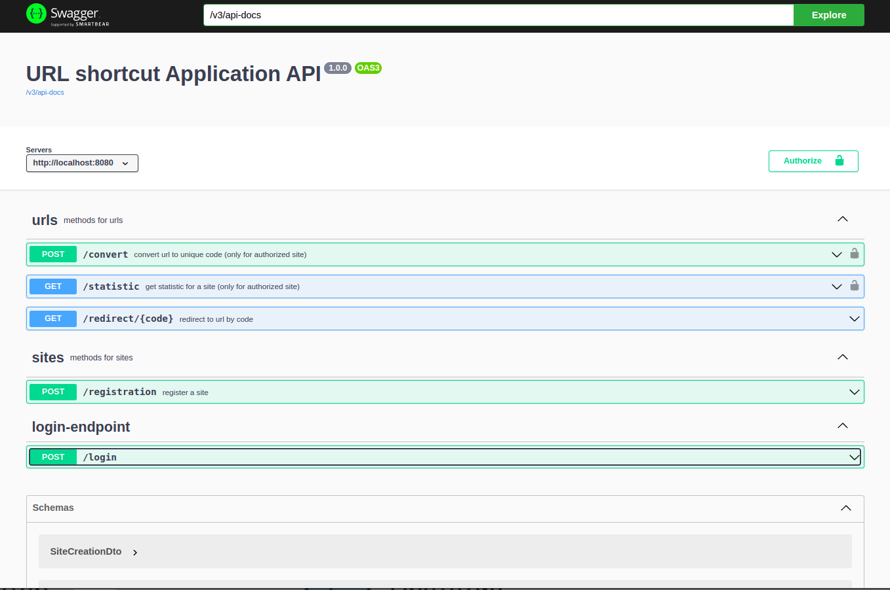
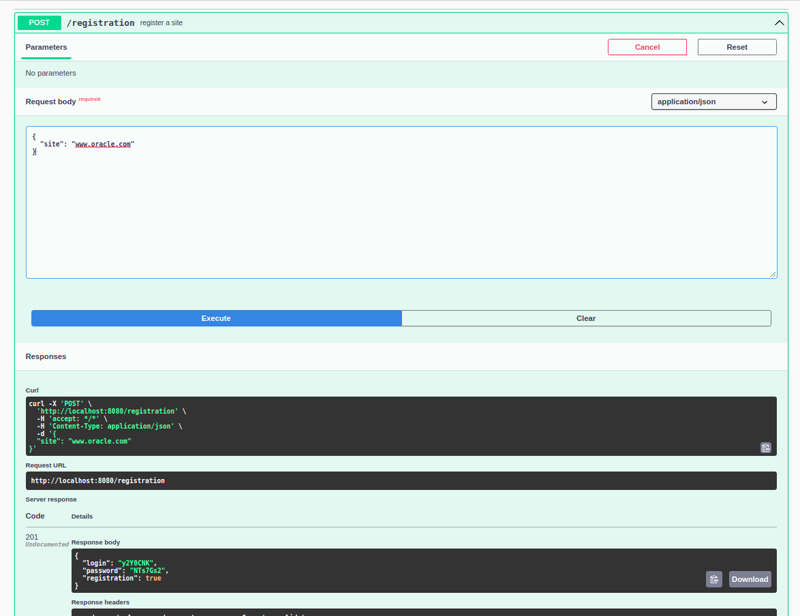
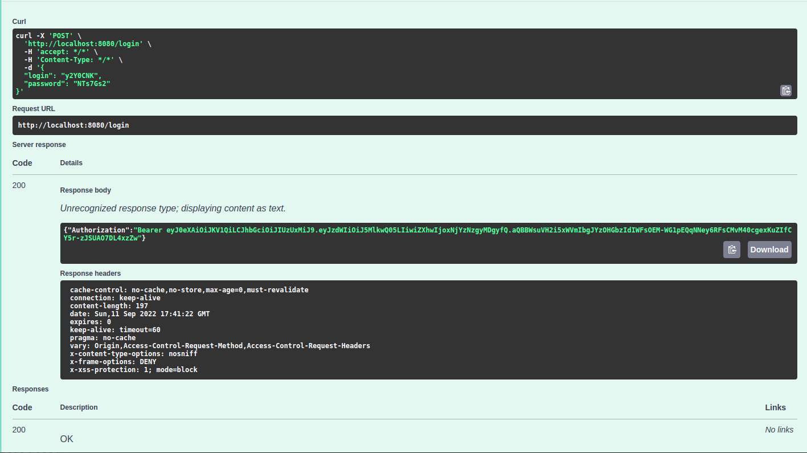
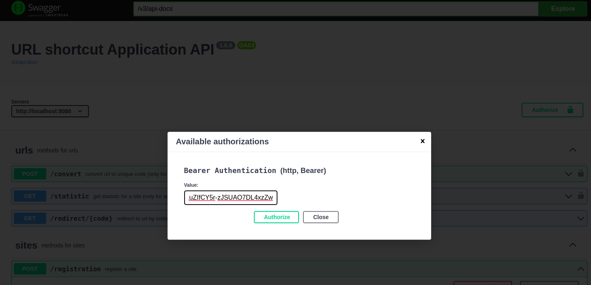
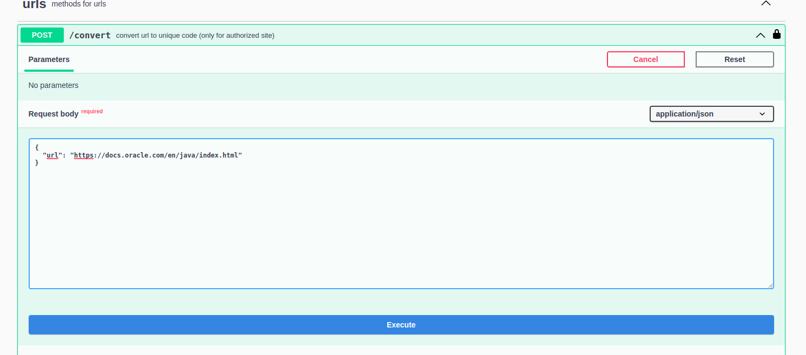
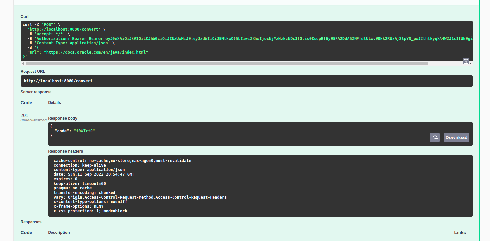
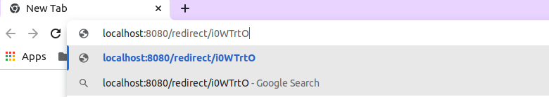
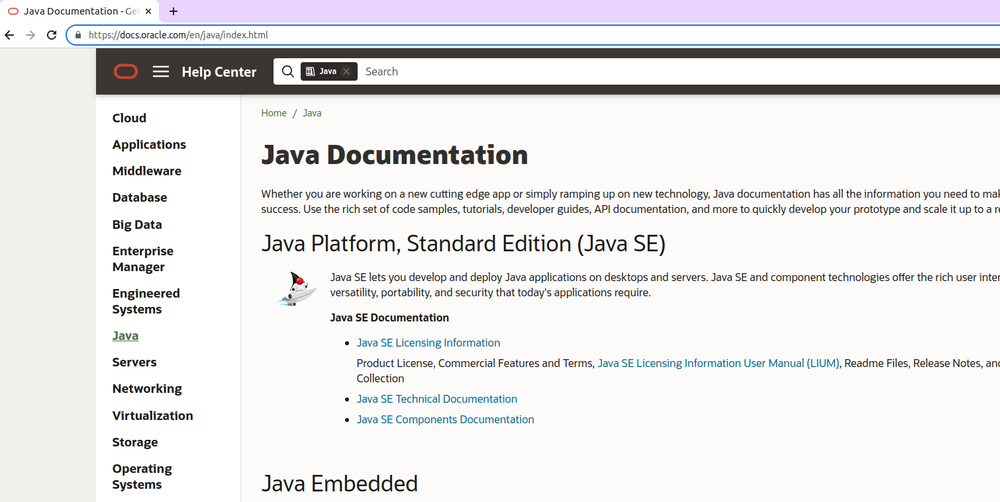
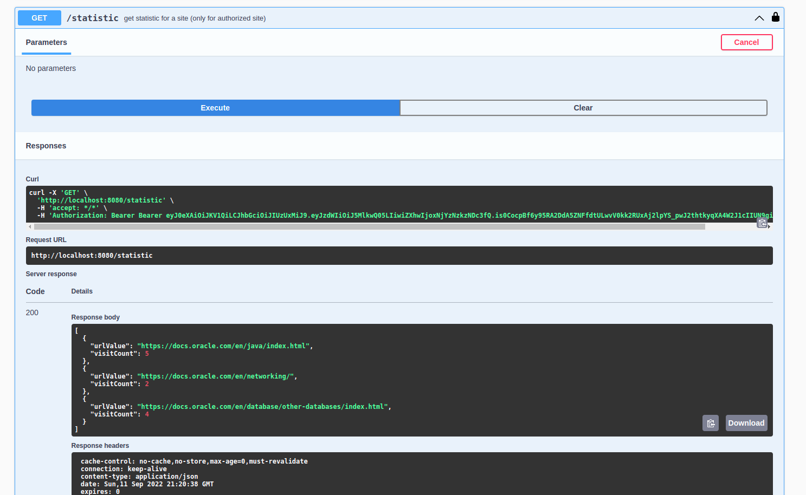
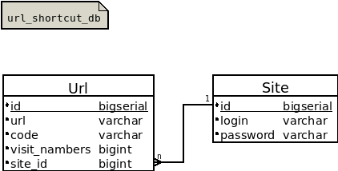

[](https://github.com/DenisYakovinov/job4j_url_shortcut/actions/workflows/maven.yml)
[](https://codecov.io/gh/DenisYakovinov/job4j_url_shortcut)
# job4j_url_shortcut

Creating a service for safely connecting users to websites <br>
The service allows the user to receive shortened links to their website. <br>
The real link is replaced with a shortened encoded string. <br>
When using a shortened link, the application will redirect to the original URL. <br>

<h2>Technologies</h2>
<ul>
    <li>Spring Boot, MVC, Data JPA, AOP, Security</li>
    <li>Postgres</li>
    <Li>liquibase</Li>
    <Li>slf4j, logback</Li>
    <Li>Swagger</Li>
    <li>Junit, Mockito</li>
</ul>
in progress..

Swagger UI documentation available via link ```localhost:8080/swagger-ui/index.html```
 <br>

1. First, register a site
login and password are generated for each registered site
 <br>

2. then, Authorize the site<br>
Authorization is carried out via JWT.<br>
The user sends a POST request with the login and password<br>
that was generated during registration and receives a JWT token<br>
This key is sent in the request in the request header.<br>
POST/registration, GET/redirect/UNIQUE CODE requests are available without authorization.<br>
 <br>
 <br>

3. URL registration.<br>
After the user has registered his site, he can send links to the site and receive converted links<br>
(shortened encoded string)
 <br>
 <br>
<br>

4. Redirection. Performed without authorization.<br>
When the site sends a link with a code, the associated address and status 302 will be returned in response.<br>
Request<br>
GET /redirect/unique_code<br>
The response from the server is in the header.<br>
HTTP CODE - 302 redirect_url<br>
as you can see<br>
 <br>
this address will be resolved to:
 <br>

5. Statistics
The service counts the number of calls for each address.<br>
The user can get the number of visits to each link on the registered site
 <br>

 <br>

To run the app (need at least java 11), clone the project
```
https://github.com/DenisYakovinov/job4j_url_shortcut.git
```
then using terminal from root directory:<br>

1. run db in docker
```
docker-compose up url_shortcut_db
```
2. then
```
mvn install
```
3. and run
```
java -jar target/url_shortcut-1.0-SNAPSHOT.jar
```
4. or
```
mvn spring-boot:run
```


